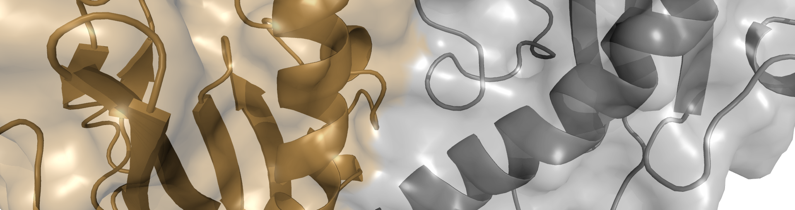
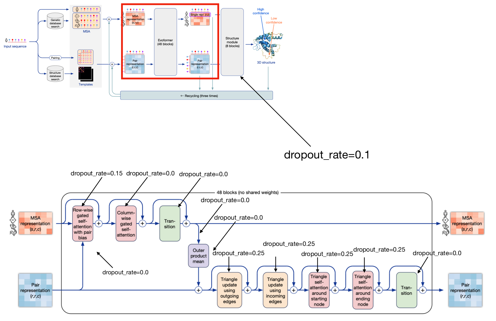

# MassiveFold

This AlphaFold version aims at massively expand the sampling of structure predictions following Björn Wallner's AFsample 
version of AlphaFold (https://github.com/bjornwallner/alphafoldv2.2.0/)
and to provide some optimizations in the computing.
These optimizations are described below with the flags that were added to the genuine DeepMind's AlphaFold.

It was started with a fork of the DeepMind's AlphaFold v2.3.1 - 10/03/2023: https://github.com/deepmind/alphafold

# Setup
The setup is the same as the one for AlphaFold v2.3 except that this repository has to be used instead of the DeepMind's
one. However, v1 and v2 neural network (NN) model parameters have to be present in the
*param* folder and should contain the version number in the name.  
Therefore, the list of NN model parameters in the folder should be as follows:

params_model_1_multimer_v1.npz  
params_model_1_multimer_v2.npz  
params_model_1_multimer_v3.npz  
params_model_1.npz  
params_model_1_ptm.npz  
params_model_2_multimer_v1.npz  
params_model_2_multimer_v2.npz  
params_model_2_multimer_v3.npz  
params_model_2.npz  
params_model_2_ptm.npz  
params_model_3_multimer_v1.npz  
params_model_3_multimer_v2.npz  
params_model_3_multimer_v3.npz  
params_model_3.npz  
params_model_3_ptm.npz  
params_model_4_multimer_v1.npz  
params_model_4_multimer_v2.npz  
params_model_4_multimer_v3.npz  
params_model_4.npz  
params_model_4_ptm.npz  
params_model_5_multimer_v1.npz  
params_model_5_multimer_v2.npz  
params_model_5_multimer_v3.npz  
params_model_5.npz  
params_model_5_ptm.npz  

Parameters for monomer and multimer v3 are available here: https://storage.googleapis.com/alphafold/alphafold_params_2022-12-06.tar  
Parameters for monomer and multimer v2 are available here: https://storage.googleapis.com/alphafold/alphafold_params_2022-03-02.tar  
Parameters for monomer and multimer v1 are available here: https://storage.googleapis.com/alphafold/alphafold_params_2021-10-27.tar  

# Added flags
Here is the list of the flags added to AlphaFold 2.3.1 (this intermediate version of AlphaFold includes the flags of 2.3.2) and their description, also accessible through the --help
option.

  **--alignments_only**: whether to generate only alignments. Only alignments will be generated by the data pipeline, the modelling will not be performed
    (default: 'false')  
  **--dropout**: turn on drop out during inference to get more diversity
    (default: 'false')  
  **--dropout_rates_filename**: provide dropout rates at inference from a json file.
  If None, default rates are used, if "dropout" is True.  
  **--max_recycles**: maximum number of recycles to run
    (default: '20')
    (an integer)  
  **--early_stop_tolerance**: early stopping threshold for recycling
    (default: '0.5')
    (a number)  
  **--bfd_max_hits**: max hits in BFD/uniref MSA
    (default: '100000')
    (an integer)  
  **--mgnify_max_hits**: max hits in mgnify MSA
    (default: '501')
    (an integer)  
 **--uniprot_max_hits**: max hits in uniprot MSA
    (default: '50000')
    (an integer)  
  **--uniref_max_hits**: max hits in uniref MSA
    (default: '10000')
    (an integer)  
  **--model_preset**: <monomer|monomer_casp14|monomer_ptm|multimer>:  
  &nbsp;&nbsp;&nbsp;&nbsp; choose preset model configuration - monomer model,  
  &nbsp;&nbsp;&nbsp;&nbsp; monomer model with extra ensembling, monomer model with pTM head, or  
  &nbsp;&nbsp;&nbsp;&nbsp; multimer model; "multimer" computes the 3 versions of multimer models by default  
  &nbsp;&nbsp;&nbsp;&nbsp; if models are not specified in the *--models_to_use* flag  
  &nbsp;&nbsp;&nbsp;&nbsp; (default: 'monomer')  
  **--models_to_use**: specify which models in *--model_preset* that should be run, each model should be formated,  
  &nbsp;&nbsp;&nbsp;&nbsp; for monomer and monomer_casp14 as model_X_, with X the number of the model,  
  &nbsp;&nbsp;&nbsp;&nbsp; for monomer_ptm as model_X _ptm, with X the number of the model,  
  &nbsp;&nbsp;&nbsp;&nbsp; for multimer as model_X_multimer_vY with X the number of the model and Y  
  &nbsp;&nbsp;&nbsp;&nbsp; the version of the model.')  
  &nbsp;&nbsp;&nbsp;&nbsp; (a comma separated list)  
  **--num_predictions_per_model**: how many predictions (each with a different random seed) will be  
  &nbsp;&nbsp;&nbsp;&nbsp; generated per model. *e.g.* if this is 2 and there are 5 models then there will be 10 predictions per input.  
  &nbsp;&nbsp;&nbsp;&nbsp; Note: this FLAG works for monomer and multimer  
  &nbsp;&nbsp;&nbsp;&nbsp; (default: '5')  
  **--start_prediction**: model to start with, can be used to parallelize jobs,  
  &nbsp;&nbsp;&nbsp;&nbsp; *e.g.* --num_predictions_per_model 20 --start_prediction 20 will only make model _20  
  &nbsp;&nbsp;&nbsp;&nbsp; *e.g.* --num_predictions_per_model 21 --start_prediction 20 will make model _20 and _21 *etc.*  
  &nbsp;&nbsp;&nbsp;&nbsp; (default: '1')  
  **--no_templates**: will not use any template, will be faster than filter by date
    (default: 'false')  
  **--template_mmcif_dir**: path to a directory with template mmCIF structures, each named <pdb_id>.cif  

# Dropout
The dropout at inference can be activated with the **--dropout** flag set to true. 
In this case, the same dropout rates as those used by DeepMind at training are used. Here are DeepMind's architectural details (Jumper J et al, Nature, 2021 - Fig 3.a),
annotated by Björn Wallner for CASP15 (https://predictioncenter.org/), that shows the various dropout rates:  



However, the **--dropout_rates_filename** flag allows to modify these rates, providing them in a json file. Here is an example of the content of
such a json file:
```json
{  
    "dropout_rate_msa_row_attention_with_pair_bias": 0.15,  
    "dropout_rate_msa_column_attention": 0.0,  
    "dropout_rate_msa_transition": 0.0,  
    "dropout_rate_outer_product_mean": 0.0,  
    "dropout_rate_triangle_attention_starting_node": 0.25,  
    "dropout_rate_triangle_attention_ending_node": 0.25,  
    "dropout_rate_triangle_multiplication_outgoing": 0.25,  
    "dropout_rate_triangle_multiplication_incoming": 0.25,  
    "dropout_rate_pair_transition": 0.0,  
    "dropout_rate_structure_module": 0.1  
}  
```

# Example
Here is an example how to run a multimer prediction with all versions of model parameters, without templates,
activating dropout at inference, with 100 recycles max and early stop tolerance set at 0.2 Angströms. The flags can be set in a separated 
text file called for instance *flags.flg* and called by the command line:
```bash
python3 ./run_alphafold.py --flagfile=./flags.flg
```
the *flags.flg* flag file containing:  

--fasta_paths=./seq.fasta  
--output_dir=./output  
--data_dir=*path_to_set*  
--uniref90_database_path=*path_to_set*  
--mgnify_database_path=*path_to_set*  
--template_mmcif_dir=*path_to_set*  
--obsolete_pdbs_path=*path_to_set*  
--bfd_database_path=*path_to_set*  
--pdb_seqres_database_path=*path_to_set*  
--uniref30_database_path=*path_to_set*  
--uniprot_database_path=*path_to_set*  
--max_template_date=2023-05-01  
--use_precomputed_msas=true  
--num_predictions_per_model=5  
--models_to_relax=best  
--use_gpu_relax=true  
--alignments_only=false  
--dropout=true  
--dropout_rates_filename=  
--max_recycles=100  
--early_stop_tolerance=0.2  
--bfd_max_hits=100000  
--mgnify_max_hits=501  
--uniprot_max_hits=50000  
--uniref_max_hits=10000  
--model_preset=multimer  
--models_to_use=  
--start_prediction=1  
--no_templates=true  

To only use a selection of models, separate them with a comma in the ***--models_to_use*** flag, *e.g.*:  
--models_to_use=model_3_multimer_v1,model_3_multimer_v3  

A script is also provided to relax only one structure. The pkl file of the prediction has to be given in parameters and the 
*features.pkl* file must be present in the folder. *e.g.*:
```bash
python3 run_relax_from_results_pkl.py result_model_4_multimer_v3_pred_0.pkl
```

# Authors
Guillaume Brysbaert (UGSF - UMR 8576, France)  
Nessim Raouraoua (UGSF - UMR 8576, France)  
Christophe Blanchet (IFB, France)  
Claudio Mirabello (NBIS, Sweden)  
Björn Wallner (Linköping University, Sweden)  

This work was partially completed at the IDRIS Open Hackathon (http://www.idris.fr/annonces/idris-gpu-hackathon-2023.html), 
part of the Open Hackathons program. The authors would like to acknowledge OpenACC-Standard.org for their support.
