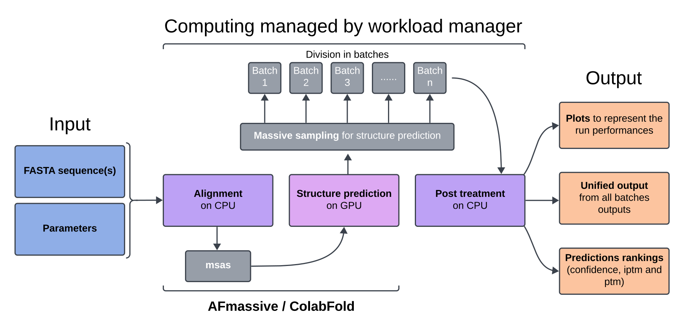
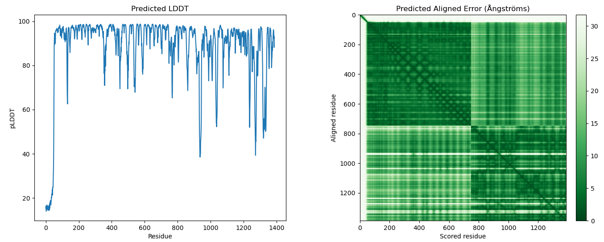
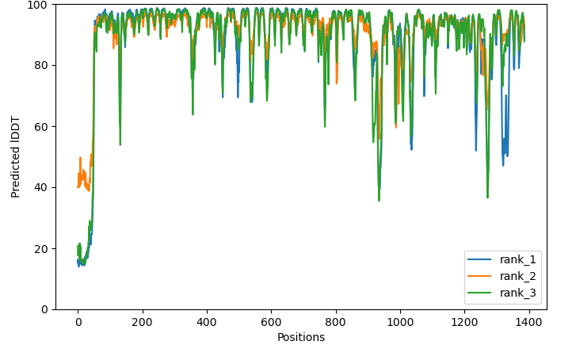
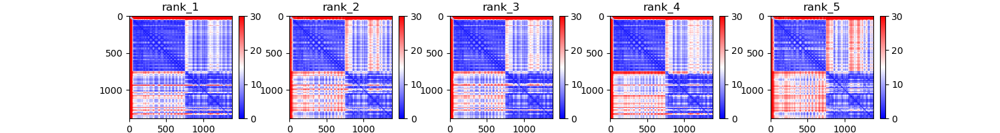
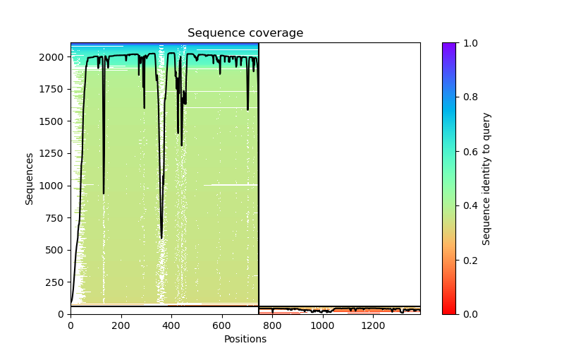
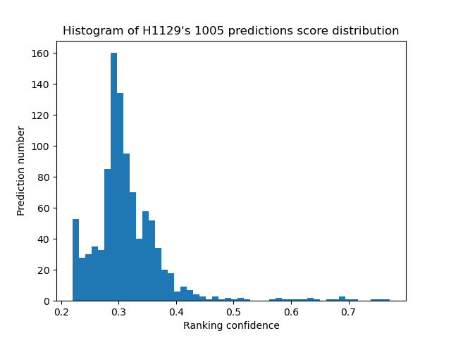
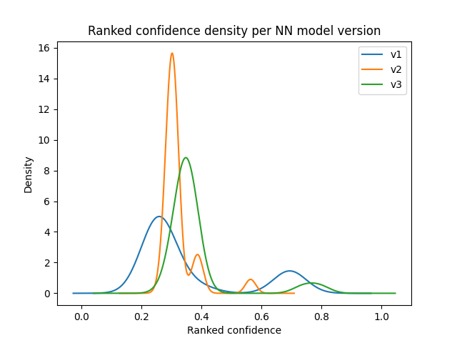
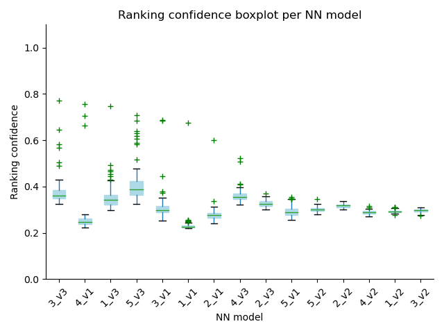
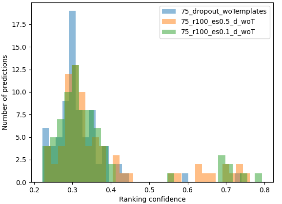
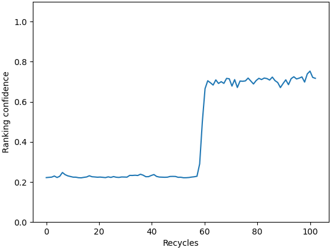

[](https://doi.org/10.5281/zenodo.13870060)

## Table of contents
<!-- TOC -->
* [MassiveFold: parallelize protein structure prediction](#massivefold-parallelize-protein-structure-prediction)
* [Installation](#installation)
  * [Steps](#steps)
  * [Jobfile's header](#jobfiles-header)
    * [Building](#building)
    * [How to add a parameter](#how-to-add-a-parameter)
  * [Installation on Jean Zay](#installation-on-jean-zay)
  * [Hardware recommendations](#hardware-recommendations)
* [Uninstallation](#uninstallation)
* [Usage](#usage)
  * [Inference workflow](#inference-workflow)
  * [Parameters](#parameters)
    * [Parameters in run_massivefold.sh](#parameters-in-run_massivefoldsh)
    * [Parameters in the json file](#parameters-in-the-json-file)
  * [Ranking](#ranking)
  * [Using ligands and modifications with AlphaFold3](#using-ligands-and-modifications-with-alphafold3)
  * [Relaxation](#relaxation)
  * [Multiple runs gathering](#multiple-runs-gathering)
* [Ligand screening with MassiveFold](#ligand-screening-with-massivefold)
  * [Format of the csv containing the ligands](#format-of-the-csv-containing-the-ligands)
  * [Gathering the outputs](#gathering-the-outputs)
* [massivefold_plots: output representation](#massivefold_plots-output-representation)
  * [Required arguments](#required-arguments)
  * [Facultative arguments](#facultative-arguments)
* [Troubleshooting](#troubleshooting)
  * [Uniref](#uniref)
  * [Usage without SLURM](#usage-without-slurm)
  * [Alignment crashes with ColabFold](#alignment-crashes-with-colabfold)
  * [Using templates with ColabFold](#using-templates-with-colabfold)
* [Citation](#citation)
* [Authors](#authors)
<!-- TOC -->


MassiveFold is a tool that allows to massively expand the sampling of structure predictions by improving the computation 
of [AlphaFold](https://github.com/google-deepmind/alphafold) based predictions.

It optimizes the parallelization of the structure inference by splitting the computation on CPU for alignments, running 
automatically batches of structure predictions on GPU, and gathering the results in one global output directory, with a 
global ranking and a variety of plots.

MassiveFold uses [AFmassive](https://github.com/GBLille/AFmassive), [ColabFold](https://github.com/sokrypton/ColabFold) 
or [AlphaFold3](https://github.com/google-deepmind/alphafold3) as inference engine; AFmassive is an updated version of Björn 
Wallner's [AFsample](https://github.com/bjornwallner/alphafoldv2.2.0/) that offers additional diversity parameters for 
massive sampling.

## MassiveFold: parallelize protein structure prediction
MassiveFold's design (see schematic below) is optimized for GPU cluster usage. It allows fast computation for massive 
sampling by automatically splitting a large run of numerous predictions into several jobs. Each of these individual 
jobs are computed on a single GPU node and their results are then gathered as a single output with each prediction 
ranked on a global level instead of the level of each individual job.  

This automatic splitting is also convenient for massive sampling on a single GPU server to manage jobs priorities.  

MassiveFold is only available with the **SLURM** workload manager (Simple Linux Utility for Resource Management) as 
it relies heavily on its features (job array, job dependency, etc...).



A run is composed of three steps:  
1. **alignment**: on CPU, sequence alignments is the first step (can be skipped if alignments are already computed)

2. **structure prediction**: on GPU, structure predictions follow the massive sampling principle. The total number 
of predictions is divided into smaller batches and each of them is distributed on a single GPU. These jobs wait for the 
alignment job to be over, if the alignments are not provided by the user.

3. **post_treatment**: on CPU, it finishes the job by gathering all batches outputs and produces plots with the 
[plots module](#massivefold_plots-output-representation) to visualize the run's performances. This job is executed only once 
all the structure predictions are over. 

## Installation

MassiveFold was developed to run massive sampling with [AFmassive](https://github.com/GBLille/AFmassive), 
[ColabFold](https://github.com/sokrypton/ColabFold) and [AlphaFold3](https://github.com/google-deepmind/alphafold3), and relies on them for its installation.

### Steps

1. **Retrieve MassiveFold**

```bash
# clone MassiveFold's repository
git clone https://github.com/GBLille/MassiveFold.git
```

For AFmassive runs, two additional installation steps are required to use MassiveFold:
- Download [sequence databases](https://github.com/GBLille/AFmassive?tab=readme-ov-file#sequence-databases)
- Retrieve the [neural network (NN) models parameters](https://github.com/GBLille/AFmassive?tab=readme-ov-file#alphafold-neural-network-model-parameters)

For ColabFold runs, two additional installation steps are required to use MassiveFold:
- Download [sequence databases](https://github.com/sokrypton/ColabFold?tab=readme-ov-file#generating-msas-for-large-scale-structurecomplex-predictions)
- Retrieve the [neural network (NN) models parameters](https://github.com/GBLille/AFmassive?tab=readme-ov-file#alphafold-neural-network-model-parameters)
and move them to a 'params' folder in the sequence databases folder (same parameters as AFmassive)

For AlphaFold3 runs, two additional installation steps are required to use MassiveFold:
- Download [sequence databases](https://github.com/google-deepmind/alphafold3/blob/main/docs/installation.md#obtaining-genetic-databases)
- Retrieve the [neural network (NN) models parameters](https://github.com/google-deepmind/alphafold3?tab=readme-ov-file#obtaining-model-parameters)

2. **Install MassiveFold**

We use an installation based on conda. The **install.sh** script we provide installs the conda environments using the 
`environment.yml`, `mf-afmassive.yml`, `mf-colabfold.yml` and `mf-alphafold3.yml` files. The first one is created for MassiveFold, 
the second one for AFmassive, the third for ColabFold and the last one for Alphafold3. It also creates the files 
architecture and set paths according to this architecture in the `AFmassive_params.json` and/or `ColabFold_params.json` 
and/or `AlphaFold3_params.json` parameters file.  

Help with:
```bash
cd MassiveFold
./install.sh -h
```

Installation with:
```bash
/install.sh [--only-envs] || --alphafold-db str --alphafold3-db str --colabfold-db str [--no-env]

./install -h for more details
  Options:
    --alphafold-db <str>: path to AlphaFold2 database
    --alphafold3-db <str>: path to AlphaFold3 database
    --colabfold-db <str>: path to ColabFold database
    --no-env: do not install the environments, only sets up the files and parameters.
      At least one of --alphafold-db or colabfold-db is required with this option.
    --only-envs: only install the environments (other arguments are not used)
```

This file tree displays the files' architecture after running `./install.sh`.

<a id="tree"></a> 
```txt
MassiveFold
├── install.sh
├── ...
├── examples
├── massivefold
└── massivefold_runs
    ├── AFmassive_params.json
    ├── ColabFold_params.json
    ├── AlphaFold3_params.json
    ├── headers/
        ├── example_header_alignment_jeanzay.slurm
        ├── example_header_jobarray_jeanzay.slurm
        └── example_header_post_treatment_jeanzay.slurm
    ├── input/
    ├── log/
    ├── output/
    └── run_massivefold.sh
```
The directory `massivefold_runs` is created, which contains:
- `AFmassive_params.json` to set the run parameters for AFmassive,
- `ColabFold_params.json` to set the run parameters for ColabFold,
- `AlphaFold3_params.json` to set the run parameters for AlphaFold3,
- `headers`' directory, containing the headers that must be created to use MassiveFold. Examples are given for the Jean 
Zay national CNRS French cluster (ready to use, see the [installation on Jean Zay](#install-on-jean-zay) to run 
MassiveFold directly on Jean Zay),
- `input` which contains the FASTA sequences,
- `log` with the logs of the MassiveFold runs (debug purposes), 
- `output` which contains the predictions, 
- `run_massivefold.sh` being the script to run [MassiveFold](#usage)

**On a GPU cluster:**  
- the **administrator** only needs to install the environments: 
```bash
cd MassiveFold
./install.sh --only-envs
```
- the **user** only needs to install the remaining files:
```bash
cd MassiveFold
./install.sh --no-env --alphafold-db <AF_DB_PATH> --colabfold-db <CF_DB_PATH> --alphafold3-db <AF3_DB_PATH>
```

***N.B.***: for <AF3_DB_PATH>, you need to use your own AlphaFold3 weights, while the database files can be shared. Therefore,
in a personal folder in your `home`, for instance in `~/af3_db` (that is your <AF3_DB_PATH>), you can copy your own weights, then 
in this folder, create symbolic links to the shared database files:

```bash
ls -s <SHARED_DB_PATH>/* ~/af3_db/
```

3. **Create header files**  

Refer to [Jobfile's header](#jobfiles-header) for this installation step.

To run MassiveFold in parallel on your cluster/server, it is **required** to build custom jobfile headers for each step. 
They are three and should be named as follows: `{step}.slurm` (`alignment.slurm`, `jobarray.slurm` and 
`post_treatment.slurm`). The headers contain the parameters to give to SLURM for the jobs running (#SBATCH parameters). 
They have to be added in `MassiveFold/massivefold_runs/headers/` directory. Depending on your installation it can be 
another path, this path has to be set in the `AFmassive_params.json` and/or `ColabFold_params.json` and/or 
`AlphaFold3_params.json` as `jobfile_headers_dir` parameter.

Headers for Jean Zay cluster are provided as examples to follow (named `example_header_<step>_jeanzay.slurm`), to use 
them, rename each one following the previously mentioned naming convention.  

4. **Set custom parameters**

Each cluster has its own specifications in parameterizing job files. For flexibility needs, you can add your custom 
parameters in your headers, and then in the `AFmassive_params.json` file and/or `ColabFold_params.json` file and/or 
`AlphaFold3_params.json` so that you can dynamically change their values in the json file.  

To illustrate these "special needs", here is an example of parameters that can be used on the French national Jean Zay 
cluster to specify GPU type, time limits or the project on which the hours are used:

Go to `AFmassive_params.json`/`ColabFold_params.json`/`AlphaFold3_params.json` location and modify it:
```bash
cd MassiveFold/massivefold_runs

"custom_params":
{
    "jeanzay_gpu": "v100",
    "jeanzay_project": "<project>",
    "jeanzay_account": "<project>@v100",
    "jeanzay_gpu_with_memory": "v100-32g",
    "jeanzay_alignment_time": "05:00:00",
    "jeanzay_jobarray_time": "15:00:00"
}
```
And specify them in the jobfile headers (such as here for `MassiveFold/headers/jobarray.slurm`) 
```
#SBATCH --account=$jeanzay_account
#SBATCH -C $jeanzay_gpu_with_memory
#SBATCH --time=$jeanzay_jobarray_time
```
### Jobfile's header

#### Building

The jobfiles for each step are built by combining the jobfile header that you have to create in 
**MassiveFold/massivefold_runs/headers/** with the jobfile body in **massivefold/parallelization/templates/**.

Only the headers have to be adapted in function of your computation infrastructure. They contain the parameters to give to 
SLURM for the job running (#SBATCH parameters).
Each of the three headers (`alignment`, `jobarray` and `post treatment`) must be located in the **headers** directory 
(see [File architecture](#installation) section).

Their names should be identical to:
* **alignment.slurm**
* **jobarray.slurm**
* **post_treatment.slurm**

The templates work with the parameters provided in `AFmassive_params.json` and/or `ColabFold_params.json` and/or 
`AlphaFold3_params.json` files, given as a parameter to the **run_massivefold.sh** script.  
These parameters are substituted in the template job files thanks to the python library [string.Template](https://docs.python.org/3.8/library/string.html#template-strings).  
Refer to [How to add a parameter](#how-to-add-a-parameter) for parameters substitution.

- **Requirement:** In the jobarray's jobfile header (*massivefold_runs/headers/jobarray.slurm*) should be stated that 
it is a job array and the number of tasks in it has to be given. The task number argument is substituted with the 
*$substitute_batch_number* parameter.  
It should be expressed as:
```
#SBATCH --array=0-$substitute_batch_number
```
For example, if there are 45 batches, with 1 batch per task of the job array, the substituted expression will be:
```
#SBATCH --array=0-44
```
- Add these lines too in the headers, it is necessary to store MassiveFold's log:

In **alignment.slurm**:
```
#SBATCH --error=${logs_dir}/${sequence_name}/${run_name}/alignment.log
#SBATCH --output=${logs_dir}/${sequence_name}/${run_name}/alignment.log
```
In **jobarray.slurm**:

```
#SBATCH --error=${logs_dir}/${sequence_name}/${run_name}/jobarray_%a.log
#SBATCH --output=${logs_dir}/${sequence_name}/${run_name}/jobarray_%a.log
```
In **post_treatment.slurm**:
```
#SBATCH --output=${logs_dir}/${sequence_name}/${run_name}/post_treatment.log
#SBATCH --error=${logs_dir}/${sequence_name}/${run_name}/post_treatment.log
```
We provide headers for the Jean Zay French CNRS national GPU cluster ([IDRIS](http://www.idris.fr/),) 
that can also be used as examples for your own infrastructure.

#### How to add a parameter

- Add **\$new_parameter** or **\$\{new_parameter\}** in the template's header where you want its value to be set and 
in the "custom_params" section of `AFmassive_params.json` and/or `ColabFold_params.json` and/or `AlphaFold3_params.json` 
where its value can be specified and modified conveniently for each run.

**Example** in the json parameters file for Jean Zay headers:
```json
"custom_params":
{
    "jeanzay_account": "project@v100",
    "jeanzay_gpu_with_memory": "v100-32g",
    "jeanzay_jobarray_time": "10:00:00"
}
```
Where "project" is your 3 letter project with allocated hours on Jean Zay.

- These parameters will be substituted in the header where the parameter keys are located:

```
#SBATCH --account=$jeanzay_account

#SBATCH --error=${logs_dir}/${sequence_name}/${run_name}/jobarray_%a.log
#SBATCH --output=${logs_dir}/${sequence_name}/${run_name}/jobarray_%a.log

#SBATCH --nodes=1
#SBATCH --ntasks-per-node=1
#SBATCH --cpus-per-task=8
#SBATCH --hint=nomultithread
#SBATCH --gpus-per-node=1
#SBATCH --array=0-$substitute_batch_number
#SBATCH --time=$jeanzay_jobarray_time
##SBATCH --qos=qos_gpu-t4               # Uncomment for job requiring more than 20h (max 16 GPUs)
#SBATCH -C $jeanzay_gpu_with_memory     # GPU type+memory
```
- Never use single \$ symbol for other uses than parameter/value substitution from the json file.\
To use $ inside the template files (bash variables or other uses), use instead $$ as an escape following 
[string.Template](https://docs.python.org/3.8/library/string.html#template-strings) documentation.

### Installation on Jean Zay

To use it on Jean Zay, the only installation steps are:
```bash
git clone https://github.com/GBLille/MassiveFold.git
./install.sh
```

To use AlphaFold3, copy your weights to the `~/af3_datadir` directory and run the following command:
```bash
ln -s $DSDIR/Alphafold3/* ~/af3_datadir/
```

The same [file architecture](#tree) is built, follow the [usage](#usage) section to use MassiveFold.

And specify the project you want to use in the `AFmassive_params.json` or `ColabFold_params.json` or `AlphaFold3_params.json`, 
replacing the `<project>` value by the 3-letters project name.  

***N.B.***: on Jean-Zay, AlphaFold3 runs only on A100 and H100. 

### Hardware recommendations

We recommend a 5 TB fast storage to host the sequence databases for AFmassive, ColabFold and AlphaFold3. The requirements in RAM 
depend on the length of the sequence(s) but 128GB should work in most cases. A GPU with at least 16 GB RAM is also recommended, 
knowing that more memory allows to model larger systems. 

## Uninstallation

To uninstall MassiveFold, remove the three conda environments (`massivefold`, `mf-afmassive-1.1.5`, `mf-colabfold-1.5.5` and 
`mf-alphafold-3.0.1`) and remove the `MassiveFold` folder you cloned. Make sure you copy all the files and folders you want 
to keep from the `output` and `log` directories somewhere else. 

## Usage

Edit the `AFmassive_params.json` and/or `ColabFold_params.json` and/or `AlphaFold3_params.json` parameters file 
(see [file architecture](#tree)).  
Set first the [parameters of your run](https://github.com/GBLille/AFmassive?tab=readme-ov-file#running-afmassive) in the 
**AFM_run** section of the `AFmassive_params.json`, for instance:
```json
"AFM_run":
{
    "model_preset": "multimer",
    "max_recycles": "20",
    "templates": "true",
    "dropout": "false",
    "dropout_structure_module": "false",
    "dropout_rates_filename": "",
    "stop_recycling_below": "0",
    "max_template_date": "2024-08-31",
    "min_score": "0",
    "max_score": "1",
    "db_preset": "full_dbs",
    "early_stop_tolerance": "0.5",
    "bfd_max_hits": "100000",
    "mgnify_max_hits": "501",
    "uniprot_max_hits": "50000",
    "uniref_max_hits": "10000"
}
```
or in the `ColabFold_params.json` file, for instance:
```json
"CF_run":
{
    "model_preset": "multimer",
    "pair_strategy": "greedy",
    "use_dropout": "false",
    "num_recycle": "20",
    "recycle_early_stop_tolerance": "0.5",
    "stop_at_score": "100",
    "disable_cluster_profile": "false"
}
```
or in the `AlphaFold3_params.json` file, for instance
```json
"AF3_run":
{
    "fasta_chains": ["protein","protein"],
     "ligand": [
            {"ccdCodes": [""], "smiles": ""}
     ],
     "PTMs": [
            [{"type": "", "sequence": "", "positions": []}]
     ],
    "model_preset": "multimer",
    "max_template_date": "2024-11-28",
    "num_diffusion_samples": "5",
    "unpairedMsa": "true",
    "pairedMsa": "true",
    "templates": "true"
}
```

**N.B.**: `"fasta_chains"` has to be filled before starting a run because no default value is provided. It specifies the 
type of each chain of the fasta file among `"protein"`, `"dna"` and `"rna"`. In this example, the two chains in the fasta 
file are proteins.

Then you can set the parameters of the **custom_params** section if necessary and the 
[plots section](#massivefold_plots-output-representation).

Activate the conda environment, then launch MassiveFold.
```bash
conda activate massivefold
./run_massivefold.sh -s <SEQUENCE_PATH> -r <RUN_NAME> -p <NUMBER_OF_PREDICTIONS_PER_MODEL> -f <JSON_PARAMETERS_FILE> -t <TOOL> 
```
**N.B.**: on the Jean Zay cluster, simply load the `massivefold` module. To be able to run on H100 or A100, uncomment the 
corresponding last lines of the `jobarray.slurm` header. Example for H100:
```
module purge
module load arch/h100
```


Example for AFmassive:
```bash
./run_massivefold.sh -s input/H1140.fasta -r afm_default_run -p 5 -f AFmassive_params.json -t AFmassive
```
Example for ColabFold:
```bash
./run_massivefold.sh -s input/H1140.fasta -r cf_default_run -p 5 -f ColabFold_params.json -t ColabFold
```
Example for AlphaFold3:
```bash
./run_massivefold.sh -s input/H1140.fasta -r af3_default_run -p 5 -f AlphaFold3_params.json -t AlphaFold3
```

For more help and list of required and facultative parameters, run:
```bash
./run_massivefold.sh -h
```
Here is the help message given by this command:
```txt
Usage: ./run_massivefold.sh -s str -r str -p int -f str -t str [ -b int | [[-C str | -c] [-w int]] ] [-m str] [-n str] [-a] [-o]
./run_massivefold.sh -h for more details 
  Required arguments:
    -s| --sequence: path of the sequence(s) to infer, should be a 'fasta' file 
    -r| --run: name chosen for the run to organize in outputs.
    -p| --predictions_per_model: number of predictions computed for each neural network model.
        If used with -t AlphaFold3, -p is the number of seeds used. Each seed will have 5 samples predicted.
        In total, with -p n, you will have 5n predictions computed.
    -f| --parameters: json file's path containing the parameters used for this run.
    -t| --tool: (default: 'AFmassive') Use either AFmassive, AlphaFold3 or ColabFold in structure prediction for MassiveFold

  Facultative arguments:
    -b| --batch_size: (default: 25) number of predictions per batch. If -b > -p, batch size will be set to -p value.
    -C| --calibration_from: path of a previous run to calibrate the batch size from (see --calibrate).
    -w| --wall_time: (default: 20) total time available for calibration computations, unit is hours.
    -m| --msas_precomputed: path to directory that contains computed msas.
    -n| --top_n_models: uses the n neural network models with best ranking confidence from this run's path.
    -j| --jobid: jobid of an alignment job to wait for inference, skips the alignments.

  Facultative options:
    -o| --only_msas: only compute alignments, the first step of MassiveFold
    -c| --calibrate: calibrate --batch_size value. Searches from the previous runs for the same 'fasta' path given
        in --sequence and uses the longest prediction time found to compute the maximal number of predictions per batch.
        This maximal number depends on the total time given by --wall_time.
    -a| --recompute_msas: purges previous alignment step and recomputes msas.
```

### Inference workflow

It launches MassiveFold with the same parameters introduced above but instead of running AFmassive or ColabFold or 
AlphaFold3 a single time, it divides it into multiple batches.

For the following examples, we assume that **--model_preset=multimer** as it is the majority of cases to run MassiveFold
in parallel.

However, **--model_preset=monomer_ptm** works too and needs to be adapted accordingly, at least the models to use (if 
parameter not set as default).

You can decide how the run will be divided by assigning `run_massivefold.sh` parameters *e.g.*:

```bash
./run_massivefold.sh -s ./input/H1140.fasta -r 1005_preds -p 67 -b 25 -f AFmassive_params.json -t AFmassive
```

The predictions are computed individually for each neural network (NN) model,  **-p** or **--predictions_per_model** 
allows to specify the number of predictions desired for each chosen model.  
These **--predictions_per_model** are then divided into batches with a fixed **-b** or **--batch_size** to optimize the 
run in parallel as each batch can be computed on a different GPU, if available.  
The last batch of each NN model is generally smaller than the others to match the number of predictions fixed by 
**--predictions_per_model**.

***N.B.***: an interest to use `run_massivefold.sh` on a single server with a single GPU is to be able to run massive 
sampling for a structure in low priority, allowing other jobs with higher priority to be run in between.

For example, with **-b 25** and **-p 67** the predictions are divided into the following batches (separated runs), which 
are repeated for each NN model:

  1.  First batch: **--start_prediction=0** and **--end_prediction=24**
  2.  Second batch: **--start_prediction=25** and **--end_prediction=49**
  3.  Third batch: **--start_prediction=50** and **--end_prediction=67** 

By default (if **--models_to_use** is not assigned), all NN models are used: with **--model_preset=multimer**, 
15 models in total = 5 neural network models $\times$ 3 AlphaFold2 versions; with **--model_preset=monomer_ptm**, 5 
neural network models are used.

The prediction number per model can be adjusted, here with 67 per model and 15 models, it amounts to **1005 predictions 
in total divided into 45 batches**, these batches can therefore be run in parallel on a GPU cluster infrastructure.

The batch size can also be auto calibrated with the `-c` or `-C` parameters if at least one basic run has already been 
performed. The `-c` parameter will automatically search in the output folder that corresponds to the input sequence for 
the longest prediction duration. These options have to be coupled with the `-w` walltime parameter (it is advised to 
adapt this walltime value to the one of the job). For instance:

```bash
./run_massivefold.sh -s ./input/H1140.fasta -r 1005_preds -p 67 -f AFmassive_params.json -c -w 10 -t AFmassive
```

### Parameters

#### Parameters in run_massivefold.sh

In addition to the parameters displayed with **-h** option, the json parameters file set with **-f** or **--parameters** 
should be organized like the `AFmassive_params.json` or `ColabFold_params.json` or `AlphaFold3_params.json` file.

#### Parameters in the json file

Each section of `AFmassive_params.json` or `ColabFold_params.json` or `AlphaFold3_params.json` is used for a different 
purpose.

The **massivefold** section designates the whole run parameters.  

```json
"massivefold": 
{
    "run_massivefold": "run_AFmassive.py",
    "run_massivefold_plots": "../massivefold/massivefold_plots.py",
    "data_dir": "$DSDIR/Alphafold-2024-04",
    "uniref_database": "",
    "jobfile_headers_dir": "./headers",
    "jobfile_templates_dir": "../massivefold/parallelization/templates",
    "output_dir": "./output",
    "logs_dir": "./log",
    "input_dir": "./input",
    "scripts_dir": "../massivefold/parallelization",
    "models_to_use": "",
    "pkl_format": "full"
}
```
The paths in the section are filled by `install.sh` but can be changed here if necessary. 
Headers (**jobfile_headers_dir**) are specified to setup the run, in order to give the parameters that are required to 
run the jobs on your cluster/server.
Build your own according to the [Jobfile's header building](#jobfiles-header-building) section.   
**models_to_use** is the list of NN models to use (for AFmassive and ColabFold). To select which NN models are used, 
separate them with a comma *e.g.*: "model_3_multimer_v1,model_3_multimer_v3", by default all are used  
**pkl_format**: how to manage pickle files (for AFmassive and ColabFold only)  
    - ‘full’ to keep the pickle files generated by the inference engine,  
    - ‘light’ to reduce its size by selecting main components, which are: number of recycles, PAE values, max PAE, 
plddt scores, ptm scores, iptm scores and ranking confidence values (stored in ./light_pkl directory)  
    - ‘none’ to remove them  
**uniref_database** is the parameter to fix the issue described in the [Troubleshooting](#troubleshooting) section (for AFmassive). 
You can change specifically uniref30 database path at this location. If not specified ("uniref_database": ""), the  
default uniref30 database path is used (same as AlphaFold2 configuration).  

- The **custom_params** section is relative to the personalized parameters that you want to add for your own cluster. 
For instance, for the Jean Zay GPU cluster:
```json
"custom_params": 
{
    "jeanzay_project": "<project>",
    "jeanzay_account": "<project>@v100",
    "jeanzay_gpu_with_memory": "v100-32g",
    "jeanzay_alignment_time": "10:00:00",
    "jeanzay_jobarray_time": "10:00:00"
}

```
As explained in [How to add a parameter](#how-to-add-a-parameter), these variables are substituted by their value when 
the jobfiles are created.

- For AFmassive, the **AFM_run** section gathers all the parameters used by MassiveFold for the run 
(see [AFmassive parameters](https://github.com/GBLille/AFmassive?tab=readme-ov-file#running-afmassive) 
section). All parameters except *--keep_pkl*, *--models_to_relax*, *--use_precomputed_msas*, *--alignment_only*, 
*--start_prediction*, *--end_prediction*, *--fasta_path* and *--output_dir* are exposed in this section.  
You can adapt the parameter values in function of your needs.  
The non exposed parameters mentioned before are set internally by the MassiveFold's pipeline or in the **massivefold** 
section (**models_to_use** and **pkl_format**).  

```json
"AFM_run":
{
    "model_preset": "multimer",
    "max_recycles": "20",
    "templates": "true",
    "dropout": "false",
    "dropout_structure_module": "false",
    "dropout_rates_filename": "",
    "stop_recycling_below": "0",
    "max_template_date": "2024-08-31",
    "min_score": "0",
    "max_score": "1",
    "db_preset": "full_dbs",
    "early_stop_tolerance": "0.5",
    "bfd_max_hits": "100000",
    "mgnify_max_hits": "501",
    "uniprot_max_hits": "50000",
    "uniref_max_hits": "10000"
}
```
Lastly, the **plots** section is used for the MassiveFold plotting module. Only `DM_plddt_PAE` and `CF_PAEs` plots are 
available for AlphaFold3. The `recycles` plot is not available for AFmassive monomers. 
```json
"plots":
{
    "MF_plots_top_n_predictions": "10",
    "MF_plots_chosen_plots": "coverage,DM_plddt_PAE,CF_PAEs,score_distribution,recycles"
}
```

### Ranking

Three ranking files are generated for each run : `ranking_debug.json`, which contains the AlphaFold confidence score for each prediction, 
`ranking_ptm.json`, which contains the pTM score for each prediction, and, for complexes, `ranking_iptm.json`, which contains the ipTM score 
for each prediction. For AlphaFold3, a `confidences` subfolder contains detailed scores for each prediction, one json file per prediction.  

***N.B.***: For AFmassive and ColabFold, even if not directly comparable between AF2 versions because using weights coming from a different 
training, the scores are used to rank all the predictions for convenience, whatever the neural network version.

### Using ligands and modifications with AlphaFold3

In MassiveFold, ligands and post modifications are configured in the `AlphaFold3_params.json` file.  

For **ligands**, the `"ligand"` section has to be filled in with a CCD code **or** a SMILES code **or** a IUPAC code. In case of several, use several 
entries in the JSON as in the following example.  

For **modifications**, the `"modifications"` section has to be filled in. 
These are the available modifications as of yet:

| Name            | Chain type    | Target residue | Target base |
|-----------------|---------------|----------------|-------------|
| glycosylation   | protein       | N, S, T, K     | null        |
| phosphorylation | protein       | S, T           | null        |
| methylation     | protein & dna | R              | C           |
| hydroxylation   | protein       | P              | null        |
| acetylation     | protein       | K              | null        |
| cyclization     | protein       | E              | null        |

The `"modifications"` section contains as many entries (list) as the number of chains in the fasta file. The order of 
these chains is the same as in the fasta file and in the `"fasta_chains"` section.

For each modification, these two keys are required:
- `"type"` is the name of the modification (e.g.: `glycosylation`) 
- `"positions"` is a list of the positions on the (fasta) sequence where the modifications have to be linked

If the modification is a glycosylation, another key is needed:
- `"sequence"` is the sequence of the glycan in IUPAC code 

The following example shows 2 protein chains (the example H1140) with 4 ligands, a total of three glycosylations and 
one phosphorylation. The first protein chain is glycosylated once (residue 36) and phosphorylated once (residue 20), 
the second is glycosylated twice (same glycan on residues 74 and 84).

```json
"AF3_run":  {
        "fasta_chains": ["protein","protein"],
        "ligand": [
            {"ccdCodes": ["NAG"]},
            {"ccdCodes": ["KGM"]},
            {"smiles": "CC(=O)OC1=CC=CC=C1C(=O)O"},
            {"IUPAC": "Gal(1-4)GlcNAc(1-2)Man(1-3)[Gal(1-4)GlcNAc(1-2)[Gal(1-4)GlcNAc(1-6)]Man(1-6)]Man(1-4)GlcNAc(1-4)[Fuc(1-6)]GlcNAc"}
        ],
        "modifications": [
            [
                    {
                        "type": "glycosylation",
                        "sequence": "Gal(1-4)GlcNAc(1-2)Man(1-3)[Gal(1-4)GlcNAc(1-2)[Gal(1-4)GlcNAc(1-6)]Man(1-6)]Man(1-4)GlcNAc(1-4)[Fuc(1-6)]GlcNAc",
                        "positions": [36]
                    },
                    {
                        "type": "phosphorylation",
                        "sequence": "",
                        "positions": [20]
                    }
            ],
            [
                    {
                        "type": "glycosylation",
                        "sequence": "Gal(1-4)GlcNAc(1-2)Man(1-3)[Gal(1-4)GlcNAc(1-2)[Gal(1-4)GlcNAc(1-6)]Man(1-6)]Man(1-4)GlcNAc(1-4)[Fuc(1-6)]GlcNAc",
                        "positions": [74,84]
                    }
            ]
        ],
        "model_preset": "multimer",
        "max_template_date": "2024-11-28",
        "num_diffusion_samples": "5",
        "unpairedMsa": "true",
        "pairedMsa": "true",
        "templates": "true"
    }
```

### Relaxation

Because the relaxation takes time and resources to compute and that the MassiveFold process splits the predictions in 
many batches, the “use_gpu_relax” and “models_to_relax” parameters are set to “false” and “none” respectively. Indeed, 
if the relaxation is activated during the process, it will be run per batches, before the final ranking, resulting in 
relaxed structures that wouldn't necessarily be the best predictions. Instead, we recommend to use the `colabfold_relax` 
program provided in the `mf-colabfold` conda environment and developed by the ColabFold team, once all the predicted 
structures are produced and ranked. It allows to relax only selected PDB structures.  
For help, type:  
```bash
colabfold_relax -h
```

### Multiple runs gathering

We provide a `gather_runs.py` script in the `massivefold` folder that allows to collate the results of several runs. It 
gathers all the results and ranks them all. Run `python3 gather_runs.py -h` for help.

We also provide an `extract_scores.py` script that allows to extract the scores from pickle files and create rankings
(notably useful for interrupted runs). Run `python3 extract_scores.py -h` for help.

## Ligand screening with MassiveFold

To launch a screening round, run:

```bash
./run_massivefold_screening.sh -s <receptor_fasta_file> -l <ligand_list_csv> -f <AlphaFold3_params.json>
```

Run -h for help, as usual:
```````bash
./run_massivefold_screening.sh -h
```````

### Format of the csv containing the ligands

This csv has 3 columns: "id", "smiles", and "ccdCode".  
Each row is a ligand to use for the screening round. "id" designates the name of the ligand, it can simply be the number of the ligand  in the list.   
For the ligand sequence, use either "smiles" or "ccdCode" but not both, respectively in the SMILES format or the Chemical Compound Dictionnary code format (ccdCode) found at https://www.ebi.ac.uk/pdbe-srv/pdbechem/.

### Gathering the outputs

The predictions for each ligand will be located in a dedicated folder, itself located in an output folder 
named with the name of the csv file. All the results, notably the scores, can be gathered with the `gather_runs.py` 
script that can be found in the `massivefold` folder. See this [section](#multiple-runs-gathering).

## massivefold_plots: output representation

MassiveFold plotting module can also be used on a MassiveFold output to evaluate visually its predictions.  

Here is an example of a basic command you can run:
```bash
conda activate massivefold
massivefold_plots.py --input_path=<path_to_MF_output> --chosen_plots=DM_plddt_PAE
```

### Required arguments
- **--input_path**: it designates MassiveFold output dir and the directory to store the plots except if you want them 
in a separate directory (use `--output_path` for this purpose)

- **--chosen_plots**: plots you want to get. You can give a list of plot names separated by a coma 
(*e.g.*: `--chosen_plots`=coverage,DM_plddt_PAE,CF_PAEs).

Here is the list of available plots:
  * DM_plddt_PAE: Deepmind's plots for predicted lddt per residue and predicted aligned error matrix
  
  * CF_plddts: ColabFold's plot for predicted lddt per residue
  
  * CF_PAEs: ColabFold's plot for predicted aligned error of the n best predictions set with *--top_n_predictions*
  
  * coverage: ColabFold's plot for sequence alignment coverage
  
  * score_distribution: performs 3 plots that summarize the score's distribution at three levels: 
    - an histogram of all scores indiscriminately  
    
    - a density plot for each neural network model version  
    
    - a boxplot for each neural network model  
    
  * distribution_comparison: ranking confidence distribution comparison between various MassiveFold outputs, typically 
  useful for runs with different sets of parameters on the same input sequence(s). The `massivefold_plots.py` script has to be used directly with the `--runs_to_compare` parameter.  
  
  * recycles: ranking confidence during the recycle process (only for multimers and ColabFold monomers)
  

### Facultative arguments
- `--top_n_predictions`: (default 10), number of best predictions to take into account for plotting
- `--runs_to_compare`: names of the runs you want to compare on their distribution, this argument is coupled with 
**--chosen_plots=distribution_comparison**

More help with
```bash
conda activate massivefold
massivefold_plots.py --help
```

## Troubleshooting

### Uniref

While using AlphaFold2 or another AlphaFold2 based software like AFmassive, you can encounter a bug similar to this one in the 
msas generation:  

`WARNING: maximum number of residues 32763 exceeded in sequence UniRef100_A0A5E4B6R9_consensus`  
or  
`WARNING: maximum number of residues 32763 exceeded in sequence UniRef100_UPI000F443DA9 titin n=1 Tax=Lagenorhynchus 
obliquidens TaxID=90247 RepID=UPI000F443DA9`  
It makes the msas unusable and causes any inference on the sequence to crash. This was referenced in a 
[github issue](https://github.com/google-deepmind/alphafold/issues/810) and a [fix](https://github.com/google-deepmind/alphafold/issues/810#issuecomment-1666718050) was provided.  
According to this fix, download an updated version of the uniref30 database. To apply this modification to MassiveFold, 
set the `uniref_database` parameter in the AFmassive_params.json file to the updated database similarly to this:

```json
"massivefold": 
{
    "run_massivefold": "run_AFmassive.py",
    "run_massivefold_plots": "../massivefold/massivefold_plots.py",
    "data_dir": "/path/to/databases/AlphaFold/",
    "uniref_database": "/path/to/databases/AlphaFold/UniRef30_2023_02_hhsuite/UniRef30_2023_02",
    "jobfile_headers_dir": "./headers",
    "jobfile_templates_dir": "../massivefold/parallelization/templates",
    "output_dir": "./output",
    "logs_dir": "./log",
    "input_dir": "./input",
    "scripts_dir": "../massivefold/parallelization",
    "models_to_use": "",
    "pkl_format": "full"
}
```

### Usage without SLURM

MassiveFold can't run without SLURM. However, the `mf-afmassive-1.1.5`, `mf-colabfold-1.5.5` and `mf-alphafold-3.0.1` 
conda environments created at the installation allow to use respectively AFmassive, ColabFold and AlphaFold3 without parallelization. 
Their usage is detailed on their respective GitHub webpages.

### Alignment crashes with ColabFold

For a few sequences, the alignment step crashes for ColabFold. In this case, the web server can be called directly to get the alignments. 
For that, activate the ColabFold environment and run directly `colabfold_batch` with the `--msa-only` parameter. 
The alignment has to be located in a `msas_colabfold` folder of the output directory that corresponds to the fasta sequence to be able to run 
the structure inference with MassiveFold.  
In the `massivefold_runs` folder, run:

```commandline
conda activate mf-colabfold-1.5.5
colabfold_batch ./input/<sequence>.fasta ./output/<sequence>/msas_colabfold --msa-only
```

### Using templates with ColabFold

MassiveFold is currently using the ColabFold 1.5.5 conda environment. It runs `colabfold_search` for the alignments and 
`colabfold_batch` for structure inference. Unfortunately, in this version, `colabfold_batch` doesn't allow to take a 
templates file as input, which means it would run the templates search for every inference job, which is not optimal.  
To be able to use templates with ColabFold, you can directly load the `mf-colabfold-1.5.5` environment and run 
`colabfold_batch` with the appropriate parameters, the `--save-all` parameter being mandatory (see `colabfold_batch -h`). 
With default parameters for alignments and templates research, it will query the MSA server.  
In case you would like to format the ColabFold output files to get the MassiveFold format, you need to put the ColabFold 
ouput files in a `batch_0` subfolder folder following the MassiveFold output file architecture :
```txt
output
└── <sequence name>
    └── <run name>
        └── batch_0 
```
Then, run the following scripts from the `massivefold_runs` folder, replacing `<sequence>` and `<run>` generic names 
with yours.
```commandline
python3 ../massivefold/parallelization/unifier.py \
    --to_convert output/<sequence>/<run>/batch_0/ \
    --conversion output_singular \
    --tool ColabFold

python3 ../massivefold/parallelization/organize_outputs.py \
    --batches_path output/<sequence>/<run>/
```

To generate plots, you can then use the `massivefold_plots.py` script as described [here](#massivefold_plots-output-representation).

## Citation

If you use MassiveFold in your work, please cite:

Raouraoua N. et al. **MassiveFold: unveiling AlphaFold’s hidden potential with optimized and parallelized massive 
sampling**. 2024. **_Nature Computational Science_**, DOI: 10.1038/s43588-024-00714-4,  
https://www.nature.com/articles/s43588-024-00714-4  

## Authors
Nessim Raouraoua (UGSF - UMR 8576, France)  
Claudio Mirabello (NBIS, Sweden)  
Thibaut Véry (IDRIS, France)  
Christophe Blanchet (IFB, France)  
Björn Wallner (Linköping University, Sweden)  
Marc F Lensink (UGSF - UMR8576, France)  
Guillaume Brysbaert (UGSF - UMR 8576, France)  

This work was carried out as part of Work Package 4 of the [MUDIS4LS project](https://www.france-bioinformatique.fr/actualites/mudis4ls-le-projet-despaces-numeriques-mutualises-pour-les-sciences-du-vivant/) led by the French Bioinformatics 
Institute ([IFB](https://www.france-bioinformatique.fr/)). It was initiated at the [IDRIS Open Hackathon](http://www.idris.fr/annonces/idris-gpu-hackathon-2023.html), part of the Open Hackathons program. 
The authors would like to acknowledge OpenACC-Standard.org for their support.
