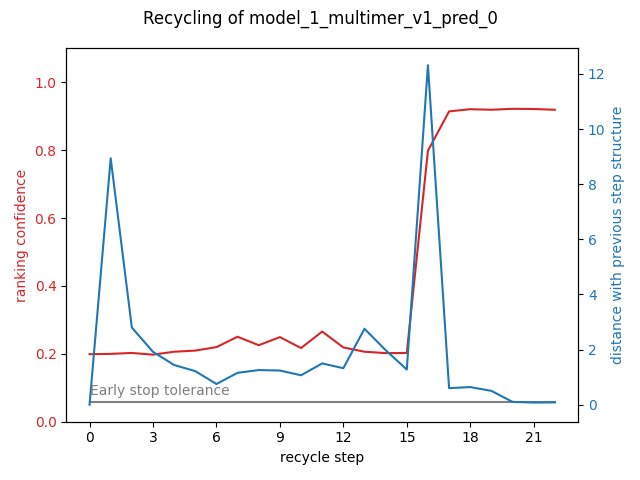

# MassiveFold

## Table of contents
<!-- TOC -->
* [Running MassiveFold in parallel](#running-massivefold-in-parallel)
* [Installation](#installation)
    * [Jobfile's header building](#jobfiles-header-building)
      * [How to add a parameter](#how-to-add-a-parameter)
  * [Usage](#usage)
    * [Inference workflow](#inference-workflow)
    * [Run parameters](#run-parameters)
      * [Parameters in MF_parallel.sh](#parameters-in-mf_parallelsh)
      * [Parameters in the json file](#parameters-in-the-json-file)
* [massivefold_plots: output representation](#massivefold_plots-output-representation)
  * [Required arguments](#required-arguments)
  * [Facultative arguments](#facultative-arguments)
* [Authors](#authors)
<!-- TOC -->

MassiveFold aims at massively expanding the sampling of structure predictions by improving the computing of AlphaFold 
based predictions. It optimizes the parallelization of the structure inference by splitting the computing on CPU 
for alignments, running automatically batches of structure predictions on GPU, finally gathering all the results in one  
final folder, with a global ranking and various plots.

MassiveFold uses AFmassive (https://github.com/GBLille/AFmassive), a modified AlphaFold version that integrates diversity  
parameters for massive sampling, as an updated version of Björn Wallner's AFsample version of AlphaFold  
(https://github.com/bjornwallner/alphafoldv2.2.0/).

# Running MassiveFold in parallel
MassiveFold is designed for an optimized use on a GPU cluster because it can automatically split a prediction run in many jobs. 
This automatic splitting is also convenient for runs on a simple GPU server. All the developments were made to be used 
with a **SLURM** workload manager, but can be adapted to any other resource managing system working with job arrays, 
simply modifying the **header** files. The following diagram shows how MassiveFold runs in parallel.


A run is composed of three steps:  
1. **alignment**: on CPU, sequence alignments is the initiation step (can be skipped if alignments are already computed)

2. **structure prediction**: on GPU, structure predictions follows the massive sampling principle. The total number 
of predictions is divided into smaller batches and each of them is distributed on a single GPU. These jobs wait for the 
alignment job to be over, if the alignments are not provided by the user.

3. **post_treatment**: on CPU, it finishes the job by gathering all batches outputs and produces plots with the 
[MF_plots module](#mf_plots-output-representation) to visualize the run's performances. This jobs is executed only once 
all the structure predictions are over. 

To run MassiveFold in parallel, you can use the parallelization module in the **MF_scripts** directory.


# Installation

MassiveFold was initially developed to run massive sampling with AFmassive (https://github.com/GBLille/AFmassive) and 
relies on it for the installation.

First, clone the MassiveFold repository, including AFmassive that will stand in the `AFM` folder:
```
git clone https://github.com/GBLille/MassiveFold_dev.git
``` 

We use an installation based on conda. You can install the conda environment using the yml file provided in the repository 
(environment.yml). 

```
conda create env -f environment.yml
conda activate massivefold-1.1.0
wget -O $CONDA_PREFIX/bin/run_AFmassive.py https://raw.githubusercontent.com/GBLille/AFmassive/devs_l/run_AFmassive.py
chmod +x $CONDA_PREFIX/bin/run_AFmassive.py
```

Sequence databases required by AlphaFold are also necessary for AFmassive runs. Please follow the corresponding section 
on the AFmassive github repository (https://github.com/GBLille/AFmassive?tab=readme-ov-file#sequence-databases).

1. **File architecture**

This file tree displays the organization of the files and folders that are mentioned in the following steps:

```bash
.
├── MassiveFold
└── massivefold_runs
    ├── input
        └── test_multimer.fasta
    ├── log
    │   └── test_multimer/basic
    │       ├── jobarray_0.log
    │       ...
    │       └── post_treatment.log
    ├── output
    │   └── test_multimer
    │       ├── basic
    │       │   ├── ranked_0_unrelaxed_model_x_multimer_vi_pred_n.pdb
    │       │   ...
    │       │   └── ranking_debug.json
    │       └── msas
    └── scripts
        ├── headers/
        ├── templates/
        ├── MF_parallel.sh
        ├── batching.py
        ├── create_jobfile.py
        ├── examine_run.py
        ├── params.json
        ├── get_batch.py
        └── organize_outputs.py
```
To set up this file tree, follow these instructions:
```bash
# Chose where to install your massivefold runs directory
./install.sh <INSTALLATION_PATH> <data_dir>
```
The **data_dir** parameter should be the path used in AlphaFold2 installation where the databases are downloaded.

2. **Create header files**  

Refer to [Jobfile header building](#jobfiles-header-building) for this installation step.

To run MassiveFold in parallel on your cluster/server, it is **required** to build custom jobfile headers for each step.  
They have to be added in the path set in the **\<INSTALLATION_PATH>/scripts/headers/** directory that can be modified in the "jobfile_headers_dir" parameter of the params.json file.  
Headers for Jean Zay cluster are provided as examples to follow (named *example_header_\<step>_jeanzay.slurm*).  

3. **Set custom parameters**

Edit the json parameter located in <INSTALLATION_PATH>/scripts/params.json. In our example:

```bash
cd <INSTALLATION_PATH>/massivefold_runs/scripts/
```
And modify params.json:
```json
 "custom_params": {
        "jeanzay_gpu": "v100",
        "jeanzay_project": "fvp",
        "jeanzay_account": "fvp@v100",
        "jeanzay_gpu_with_memory": "v100",
        "jeanzay_alignment_time": "10:00:00",
        "jeanzay_jobarray_time": "02:00:00"
 },
...
```
The **data_dir** parameter should be the path used in AlphaFold2 installation where the databases are downloaded.

4. **Launch a run**

Set the parameters of your run in the **MF_run** section of the **params.json** file, then run massivefold in parallel with, for instance:
```bash
./MF_parallel -s ../input/test_multimer.fasta -r basic_run -p 67 -f params.json
```
For more help, run:
```bash
./MF_parallel -h
```

### Jobfile's header building

The jobfile templates for each step are built by combining the jobfile header that you have to create in 
**MF_scripts/parallelization/headers** with the jobfile body in **MF_scripts/parallelization/templates/**.

Only the headers have to be adapted in function of your computing infrastructure. 
Each of the three headers (alignment, jobarray and post treatment) must be located in the **headers** directory 
inside the **pipeline** directory (see [File architecture](#setup-1) section).

Their names should be identical to:
* **header_alignment.slurm**
* **header_jobarray.slurm**
* **header_post_treatment.slurm**

The templates work with the parameters provided in **run_params.json** given as a parameter to the **MF_parallel.sh** script.\
These parameters are substituted in the template job files thanks to the python library [string.Template](https://docs.python.org/3.8/library/string.html#template-strings).\
Refer to [How to add a parameter](#how-to-add-a-parameter) for parameter substitution.

- **Requirement:** In the jobarray header should be stated that it is a job array and the number of tasks in it has to 
be given.\
The task number argument is substituted with the *$substitute_batch_number* parameter.\
For slurm, the expression should be:
```bash
#SBATCH --array=0-$substitute_batch_number
```
For example, if there are 45 batches, with one batch per task of the job array, the substituted expression will be:
```bash
#SBATCH --array=0-44
```

- To store jobfile logs while following [Setup](#setup-1)'s file tree, add these lines in the headers:

In **header_alignment.slurm**:
```bash
#SBATCH --error=${logs_dir}/${sequence_name}/${run_name}/alignment.log
#SBATCH --output=${logs_dir}/${sequence_name}/${run_name}/alignment.log
```
In **header_jobarray.slurm**:

```bash
#SBATCH --error=${logs_dir}/${sequence_name}/${run_name}/jobarray_%a.log
#SBATCH --output=${logs_dir}/${sequence_name}/${run_name}/jobarray_%a.log
```
In **header_post_treatment.slurm**:
```bash
#SBATCH --output=${logs_dir}/${sequence_name}/${run_name}/post_treatment.log
#SBATCH --error=${logs_dir}/${sequence_name}/${run_name}/post_treatment.log
```
On the git, we provide templates for the Jean Zay french CNRS national GPU cluster accessible at the 
[IDRIS](http://www.idris.fr/).

#### How to add a parameter
- Add **\$new_parameter** or **\$\{new_parameter\}** in the template where you want its value to be set and in the 
"custom_params" section of **run_params.json** where its value can be specified and changed for each run.

**Example** in the json parameters file for Jean Zay headers:
```json
...
  "custom_params": {
      "jeanzay_account": "project@v100",
      "jeanzay_gpu_with_memory": "v100-32g",
      "jeanzay_jobarray_time": "10:00:00"
  },
...
```
Where project is your 3 letter project with allocated hours on Jean Zay.

- These parameters will be substituted in the header where the parameter keys are located:

```bash
#SBATCH --account=$jeanzay_account

#SBATCH --error=${logs_dir}/${sequence_name}/${run_name}/jobarray_%a.log
#SBATCH --output=${logs_dir}/${sequence_name}/${run_name}/jobarray_%a.log

#SBATCH --nodes=1
#SBATCH --ntasks-per-node=1
#SBATCH --cpus-per-task=8
#SBATCH --hint=nomultithread
#SBATCH --gpus-per-node=1
#SBATCH --array=0-$substitute_batch_number
#SBATCH --time=$jeanzay_jobarray_time
##SBATCH --qos=qos_gpu-dev             # Uncomment for job requiring less than 2 hours
##SBATCH --qos=qos_gpu-t4         # Uncomment for job requiring more than 20h (max 16 GPUs)
#SBATCH -C $jeanzay_gpu_with_memory             # Use gpu
```
- Never use single \$ symbol for other uses than parameter/value substitution from the json file.\
To use $ inside the template files (bash variables or other uses), use instead $$ as an escape following 
[string.Template](https://docs.python.org/3.8/library/string.html#template-strings) documentation.

## Usage

```bash
./MF_parallel.sh -s sequence_path -r run_name -p predictions_per_model -f parameters_file 
```
Other facultative parameters can be set and can be consulted with:

```bash
./MF_parallel.sh -h
```
This is the help message associated with this command:

```txt
Usage: ./MF_parallel.sh -s str -r str -p int -f str [-m str] [-n str] [-b int | [[-C str | -c] [-w int]] ]
./MF_parallel.sh -h for more details 
  Required arguments:
    -s| --sequence: name of the sequence to infer, same as input file without '.fasta'.
    -r| --run: name chosen for the run to organize in outputs.
    -p| --predictions_per_model: number of predictions computed for each neural network model.
    -f| --parameters: json file's path containing the parameters used for this run.

  Facultative arguments:
    -b| --batch_size: number of predictions per batch, should not be higher than -p (default: 25).
    -m| --msas_precomputed: path to directory that contains computed msas.
    -n| --top_n_models: uses the 5 models with best ranking confidence from this run's path.
    -w| --wall_time: total time available for calibration computations, unit is hours (default: 20).
    -C| --calibration_from: path of a previous run to calibrate the batch size from (see --calibrate).

  Facultative options:
    -c| --calibrate: calibrate --batch_size value. Searches for this sequence previous runs and uses
        the longest prediction time found to compute the maximal number of prediction per batch.
        This maximal number depends on the total time given by --wall_time.
```
### Inference workflow

It launches MassiveFold with the same parameters introduced above but instead of running **run_alphafold.py** script a single time, 
it divides it in multiple batches.


For the following examples, we assume that **--model_preset=multimer** as it is the majority of cases to run MassiveFold in parallel.

However, **--model_preset=monomer_ptm** works too and needs to be adapted accordingly, at least the models to use.

You can decide how the run will be divided by assigning **MF_parallel.sh** parameters *e.g.*:

```bash
./MF_parallel.sh -s ..input/H1144.fasta -r 1005_preds -p 67 -b 25 -f run_params.json
```

The predictions are computed individually for each neural network model,  **-p** or **--predictions_per_model** allows to specify 
the number of predictions desired for each chosen model.\
These **--predictions_per_model** are then divided into batches with a fixed **-b** or **--batch_size** to optimize the run 
in parallel as each batch can be computed on a different GPU, if available. The last batch of the cycle is generally smaller 
than the others to match the number of predictions fixed by **--predictions_per_model**.

***N.B.***: an interest to use MF_parallel.sh on a single server with a single GPU is to be able to run massive sampling for a 
structure in low priority, allowing small jobs with higher priority to be run in between.

For example, with **-b 25** and **-p 67** the predictions are divided into the following batches, which is repeated 
for each NN model:

  1.  First batch: **--start_prediction=0** and **--num_predictions_per_model=24**
  2.  Second batch: **--start_prediction=25** and **--num_predictions_per_model=49**
  3.  Third batch: **--start_prediction=50** and **--num_predictions_per_model=67** 

By default (if **--models_to_use** is not assigned), all NN models are used: with **--model_preset=multimer**, 15 models 
in total = 5 neural network models $\times$ 3 AlphaFold2 versions.

The prediction number per model can be adjusted, here with 67 per model and 15 models, it amounts to **1005 predictions 
in total divided into 45 batches**.

### Run parameters

#### Parameters in MF_parallel.sh

In addition to the parameters displayed with -h option, the parameters file set in **-f** or **--parameters** should be 
organized as *MF_scripts/parallelization/generic_params.json*.

#### Parameters in the json file

Each section of **run_params.json** is used for a different purpose.

The section **MF_parallel** designates the parameters relative to the whole run.  

It is presented as:

```json
   "MF_parallel": {
       "run_massivefold": "<cloned_repo_path>/run_alphafold.py",
       "run_massivefold_plots": "<cloned_repo_path>/MF_scripts/plots/MF_plots.py",
       "data_dir": "<data_dir>",
       "jobfile_header_dir": "<INSTALLATION_PATH>/headers/",
       "jobfile_templates_dir": "<INSTALLATION_PATH>/templates",
       "output_dir": "../output",
       "logs_dir": "../log",
       "predictions_to_relax": "",
       "models_to_use": ""
   },
...
```
You have to fill the paths in this section. Templates are specified here to setup the run, build your owns according to the [Template building](#jobfiles-header-building) section.

- The **custom_params** section is relative to the personalized parameters that you want to add for your own cluster. 
For instance, for the Jean Zay GPU cluster:
```json
...
  "custom_params": 
    {
      "jeanzay_project": "project",
      "jeanzay_account": "project@v100",
      "jeanzay_gpu_with_memory": "v100-32g",
      "jeanzay_alignment_time": "10:00:00",
      "jeanzay_jobarray_time": "10:00:00"
    }
...
```
As explained in [How to add a parameter](#how-to-add-a-parameter), these variables are substituted by their value 
when the jobfiles are created.

- The **MF_run** section gathers all the parameters used by MassiveFold for the run. (see [Example](#example) and 
[Added parameters](#added-parameters)). All parameters  except *--models_to_relax*, *--use_precomputed_msas*, *--alignment_only*, *--start_prediction*, *--end_prediction*, *--fasta_path* and *--output_dir* are exposed in this
section.\
You can adapt the parameters values in function of your needs.\
The non exposed parameters mentioned before are set in intern by the MF_parallel.sh pipeline.

```json
... 
 "MF_run": {
    "MF_run_model_preset": "multimer",
    "MF_run_dropout": "false",
    "MF_run_dropout_structure_module": "false",
    "MF_run_dropout_rates_filename": "",
    "MF_run_templates": "true",
    "MF_run_min_score": "0",
    "MF_run_max_batch_score": "1",
    "MF_run_max_recycles": "20",
    "MF_run_db_preset": "full_dbs",
    "MF_run_use_gpu_relax": "true",
    "MF_run_models_to_relax": "none",
    "MF_run_early_stop_tolerance": "0.5",
    "MF_run_bfd_max_hits": "100000",
    "MF_run_mgnify_max_hits": "501",
    "MF_run_uniprot_max_hits": "50000",
    "MF_run_uniref_max_hits": "10000"
},
...
```
Lastly, section **MF_plots** is used for the MassiveFold plotting module.

```json
...
  "MF_plots": 
    {
      "MF_plots_top_n_predictions":"5",
      "MF_plots_chosen_plots": "coverage,DM_plddt_PAE,CF_PAEs"
    }
```
# massivefold_plots: output representation

MassiveFold plotting module can be used on a MassiveFold output to represent its results efficiency.  

Here is an example of a basic command you can run:
```bash
./massivefold_plots.py --input_path=<path_to_MF_output> --chosen_plots=DM_plddt_PAE
```
## Required arguments
- **--input_path**: it designates MassiveFold output dir and the directory to store the plots except if you want them in a separate directory, use *--output_path* for this purpose

- **--chosen_plots**: plots you want to get. You can give a list of plot names separated by a coma (e.g: *--chosen_plots=coverage,DM_plddt_PAE,CF_PAEs*). This is the list of all the plots available:
  * DM_plddt_PAE: Deepmind's plot for predicted lddt per residue and predicted aligned error matrix
  
  * CF_plddt:
  * CF_PAEs: Colabfold's plot for predicted aligned error of the n best predictions set with *--top_n_predictions*
  
  * CF_plddts:
  
  * coverage: Colabfold's plot for sequence alignment coverage
  
  * score_distribution:
  * distribution_comparison: ranking confidence distribution comparison between different massivefold outputs, tipically useful for runs with different parameters on the same sequence.
  
  * recycles: ranking confidence during the recycle process
  

## Facultative arguments
- *--top_n_predictions*: (default 10), number of predictions taken into account for plotting, it will be the n best predictions
- *--runs_to_compare*: names of the runs you want to compare on their distribution,this argument is coupled with **--chosen_plots=distribution_comparison**

# Authors
Guillaume Brysbaert (UGSF - UMR 8576, France)  
Nessim Raouraoua (UGSF - UMR 8576, France)  
Marc F Lensink (UGSF - UMR8576, France)  
Christophe Blanchet (IFB, France)  
Claudio Mirabello (NBIS, Sweden)  
Björn Wallner (Linköping University, Sweden)  

This work was carried out as part of the Work Package 4 of the [MUDIS4LS project](https://www.france-bioinformatique.fr/actualites/mudis4ls-le-projet-despaces-numeriques-mutualises-pour-les-sciences-du-vivant/) 
lead by the French Bioinformatics Institute ([IFB](https://www.france-bioinformatique.fr/)). It was initiated at the [IDRIS Open Hackathon](http://www.idris.fr/annonces/idris-gpu-hackathon-2023.html), 
part of the Open Hackathons program. The authors would like to acknowledge OpenACC-Standard.org for their support.
