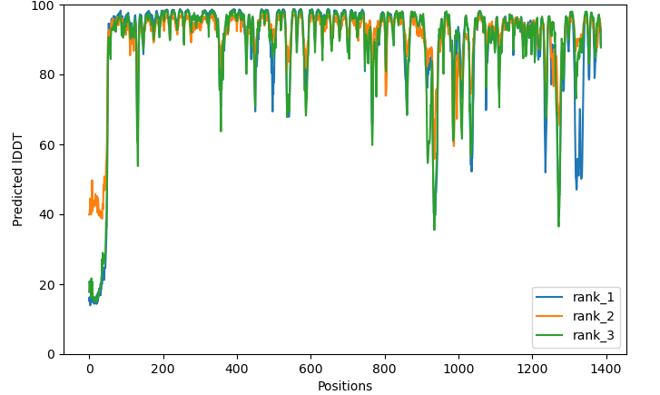
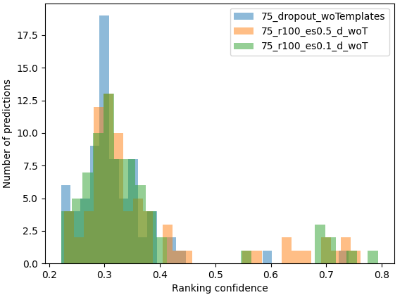

## massivefold_plots: output representation

MassiveFold plotting module can also be used on a MassiveFold output to evaluate visually its predictions.  

Here is an example of a basic command you can run:
```bash
conda activate massivefold
massivefold_plots.py --input_path=<path_to_MF_output> --chosen_plots=DM_plddt_PAE
```

### Required arguments
- **--input_path**: it designates MassiveFold output dir and the directory to store the plots except if you want them 
in a separate directory (use `--output_path` for this purpose)

- **--chosen_plots**: plots you want to get. You can give a list of plot names separated by a coma 
(*e.g.*: `--chosen_plots`=coverage,DM_plddt_PAE,CF_PAEs).

Here is the list of available plots:
  * DM_plddt_PAE: Deepmind's plots for predicted lddt per residue and predicted aligned error matrix
  
  * CF_plddts: ColabFold's plot for predicted lddt per residue
  
  * CF_PAEs: ColabFold's plot for predicted aligned error of the n best predictions set with *--top_n_predictions*
  
  * coverage: ColabFold's plot for sequence alignment coverage
  
  * score_distribution: performs 3 plots that summarize the score's distribution at three levels: 
    - an histogram of all scores indiscriminately  
    
    - a density plot for each neural network model version  
    
    - a boxplot for each neural network model  
    
  * distribution_comparison: ranking confidence distribution comparison between various MassiveFold outputs, typically 
  useful for runs with different sets of parameters on the same input sequence(s). The `massivefold_plots.py` script has to be used directly with the `--runs_to_compare` parameter.  
  
  * recycles: ranking confidence during the recycle process (only for multimers and ColabFold monomers)
  